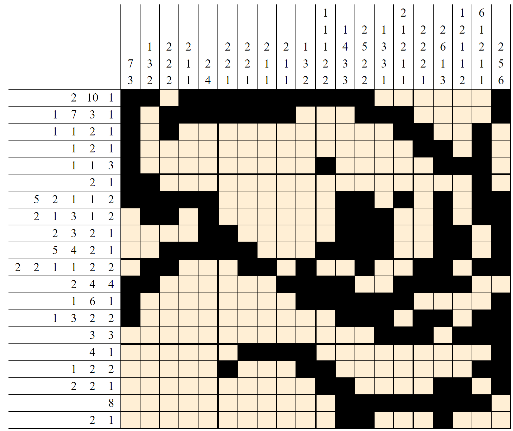

# GriddlerSolverJS

A griddler puzzle solver written in JavaScript.  
This was done as a side project with no real purpose... It was just pure fun.

To play, go the [Griddler Solver](https://yinonavraham.github.io/GriddlerSolverJS/griddlers.html) page.

## Key Features

* Includes several examples of griddler puzzles
* Manual griddler solving
* Automatic griddler solving by the solver
* The solution is iterative and is animated (fun! fun! fun!)

An example of a solved griddler:  

For more griddlers, go to [griddlers.net](https://www.griddlers.net).

## Contributing

Pull requests are more than welcome - new puzzles, new features, bug fixes, documentation, everything.
